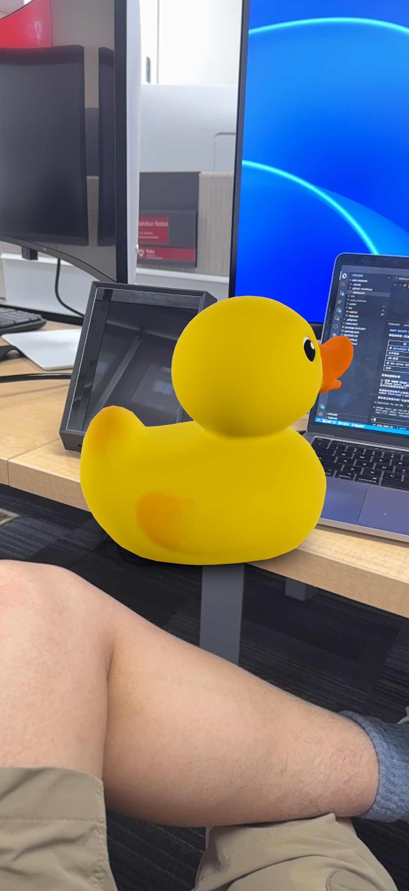
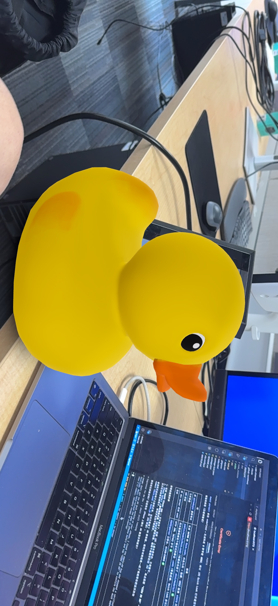

# Lab 1 starter — Vite + Three.js + WebXR

[](https://github.com/Xin-Ray/webxr/actions/workflows/deploy.yml)

A minimal but complete WebXR app. Renders a rubber-duck glTF model + ground in a regular browser, and lets you tap-to-place the duck in AR on supported devices.

**Live URL:** https://xin-ray.github.io/webxr/ — see [`WRITEUP.md`](WRITEUP.md) for what was done.

## Demo

Tap-to-place AR running on iPhone (in the XR Viewer app, which provides WebXR + hit-test) — the rubber duck dropped onto a real desk:

<p align="center">
  
  
</p>

Screen recordings: [clip 1](pictures/ScreenRecording_06-10-2026%2015-48-40_1.MP4) · [clip 2](pictures/ScreenRecording_06-10-2026%2016-46-16_1.MP4).

## Requirements

- **Node 20+** and npm 10+. Check with `node --version`. The `package.json` enforces this via `engines`.
- A modern browser (Chrome 110+, Edge 110+, or the Quest browser).
- For real AR: a Quest 2/3/Pro or an Android phone with ARCore (WebXR), or an iPhone/iPad (iOS opens the model in AR Quick Look — see below).

## Run locally

The same two commands work on every OS — Vite, Three.js, and `@vitejs/plugin-basic-ssl` are all pure-JS:

```bash
npm install
npm run dev -- --host
```

Vite prints two URLs. **Open the `https://` one** — WebXR requires HTTPS even on localhost.

The `@vitejs/plugin-basic-ssl` plugin generates a self-signed cert at runtime; accept the browser warning once. To view from a phone, see [Testing on your phone](#testing-on-your-phone-android) below — on native Windows/macOS/Linux the **LAN** URL Vite prints works (allow Node through the firewall when prompted); on WSL2 it does not, so use the USB or tunnel method.

### Platform-specific tips

| OS                     | Tip                                                                                                |
|------------------------|----------------------------------------------------------------------------------------------------|
| **macOS / Linux**      | Just works.                                                                                        |
| **Windows + PowerShell** | If you see "running scripts is disabled" when invoking `npm`, run PowerShell as admin once and `Set-ExecutionPolicy -Scope CurrentUser RemoteSigned`. |
| **Windows + cmd**      | Works, but use `npm run dev -- --host` exactly as written (the `--` is significant).               |
| **Windows + Git Bash** | Identical to Linux.                                                                                |
| **WSL2**               | Works. The LAN URL Vite prints is the WSL VM's internal IP, not reachable from other devices — see [Testing on your phone](#testing-on-your-phone-android) for the USB and tunnel methods. |

## Testing on your phone (Android)

The AR flow only runs on a real device. On WSL2 the LAN URL Vite prints is the WSL VM's internal IP, so a phone on the same Wi-Fi cannot reach it. Two methods that work:

### USB + Chrome port forwarding (most reliable)

Connects the phone straight to the laptop — no Wi-Fi needed, and no cert warning.

1. On the phone, enable **Developer options → USB debugging**, then plug it into the laptop.
2. Keep `npm run dev` running. WSL2 forwards `localhost:5173` to Windows automatically.
3. In desktop Chrome, open `chrome://inspect/#devices`, check **Port forwarding**, add `5173` mapped to `localhost:5173`, and Enable.
4. On the phone, open `https://localhost:5173/`.

The phone sees `localhost`, so the browser treats it as a secure context — WebXR works and there is no self-signed-cert prompt. Tap **AR** to enter immersive mode (uses ARCore).

### Tunnel (any network, trusted cert)

If USB is unavailable or campus Wi-Fi blocks device-to-device traffic, expose the server with a public HTTPS URL:

```bash
ngrok http https://localhost:5173
# or: cloudflared tunnel --url https://localhost:5173
```

Open the printed `https://….ngrok.app` URL on the phone. Trusted cert, no warning, and it works over cellular too.

## Test in immersive mode

| Device                       | What to do                                                                                                          |
|------------------------------|---------------------------------------------------------------------------------------------------------------------|
| Meta Quest 2/3/Pro           | Open the LAN URL in the built-in browser; tap **AR** at the bottom.                                                 |
| Android (Chrome 110+)        | Open in Chrome; tap **AR**. Will use ARCore.                                                                        |
| iPhone / iPad                | Safari has no WebXR, so the page shows a **VIEW IN AR** button instead. Tap it to open the duck in iOS **AR Quick Look** (loads `models/Duck.usdz`). The deprecated WebXR Viewer app is *not* needed. |
| Desktop                      | Drag to orbit; no AR button appears — that's expected.                                                  |

## Deploy to GitHub Pages

This template ships a GitHub Actions workflow (`.github/workflows/deploy.yml`) that builds and deploys on every push to `main`. Turn it on once:

1. Push the repo to GitHub.
2. Go to **Settings → Pages → Build and deployment → Source** and choose **GitHub Actions**.
3. Push to `main`. The workflow runs `npm ci && npm run build` and publishes `dist/`. Your live URL appears in the workflow run and under **Settings → Pages**.

A green build badge (top of this README, after you set `USER/REPO`) means the project compiled and deployed — fast evidence that the lab at least builds.

Prefer to deploy by hand? `npm run build && npx gh-pages -d dist`.

The `base: './'` in `vite.config.js` produces relative asset URLs, so the site works whether it is served from the domain root or a `username.github.io/repo/` sub-path. If your Vite project lives in a subfolder of the repo, add a `defaults.run.working-directory` to the workflow's `build` job and update the artifact `path:` to match.

## What's in here

- `src/main.js` — Three.js scene, WebXR AR button + hit-test reticle + tap-to-place, an iOS AR Quick Look fallback button, and a non-XR orbit fallback.
- `public/models/Duck.glb` — the WebXR model; `public/models/Duck.usdz` — the same duck as USDZ for iOS AR Quick Look.
- `vite.config.js` — HTTPS dev server (required by WebXR).
- `index.html`, `src/style.css` — minimal HTML shell.

## What you need to do for Lab 1

This is a starter, not a finished assignment. To get full marks you still need to replace the starter cube with a glTF model of your choice (placed on tap), deploy a live URL, and write a `WRITEUP.md` and `demo.mp4`. See [`../lab1/README.md`](../lab1/README.md) for the lab spec and `../labs.md` for the rubric.
